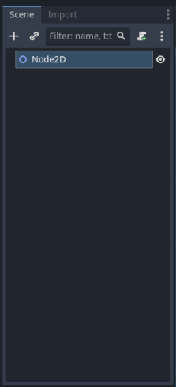
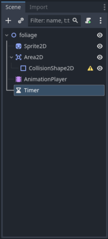
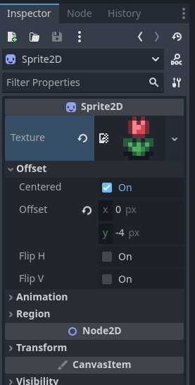
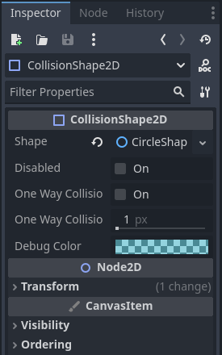
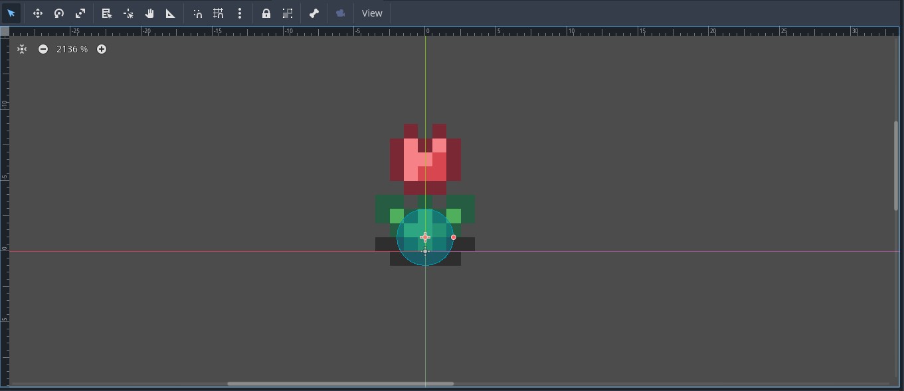
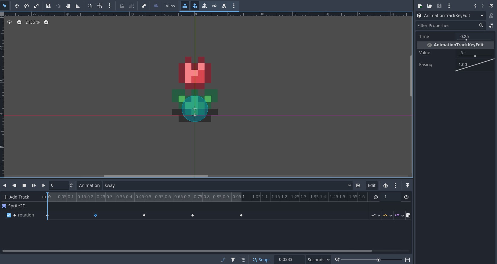

# Grass/foliage sway with player collision

This tutorial will allow your grass, flowers, signs or anything else you'd like to sway back and forth when a player touches it. This can be extended for NPC collisions as well. 

## Tutorial

1. Begin by creating a new `Node2D` scene that will act as a world/level

    

2. Create a separate `Node2D` scene that will act as the grass/foliage instance.

    - In this foliage `Node2D` nest a `Sprite2D` node that will house the sprite texture. It is important to note that if you are using a sprite that comes in a tileset, you will need to separate this from the tileset using the art software of your choice. I like using pixel art and I use Aseprite as my art software. Make sure the image file is only the sprite that you need.

    - Also add an `Area2D` with a nested `CollisionShape2D` to this foliage `Node2D` that will act as the collision area for the foliage. Ultimately, when the character enters this area, the foliage will sway.

    - Add an `AnimationPlayer` node to the foliage `Node2D` that will house the sway animation we will add.

    - Finally, add a `Timer` node. This will allow the animations to be smoother as they will play out even after the character has left the collision area rather than stop abruptly.

    

3. Open the `Sprite2D` node inspector. Click on empty next to `Texture` and select Load (or Quick Load if you have added the image file to your project FileSystem). Locate your image file of choice and choose it to be loaded. This will populate your image in the view window. At this point you can also change the `Offset` within the `Sprite2D` node inspector. This will allow you to change the pivot point of your animation. For me, I wanted the pivot point of my flower to be at its base, so I adjusted the y offset accordingly. Adjust so that the `+` in the view window is at the point you'd like the pivot to occur.

    

4. In the `CollisionShape2D`, check the node inspector and click on the empty next to `Shape`. You can choose which shape you would like (you may also opt to turn your `CollisionShape2D` into a `CollisionPolygon2D` which will give you much more freedom in determining your sprites collision area). Adjust the size of your `CollisionShape2D` according to your needs. You can do this by grabbing `+` in the view window and moving or grabbing the `.` and changing the size.

    

    

5. After clicking on the `AnimationPlayer` in the node tree, an `Animation` tab should open at the bottom of your screen in the editor window. Here, press the button that says `Animation` and this will allow you to make a new animation by pressing `New..`. The animation I chose to implement was a sway. You can call the animation whatever you'd like, but you will have to reference by name later in the scripting. From here, click the `Add Track` button and select `Property Track..`. This will open a window where you will be able to select the `Sprite2D` attached to the foliage `Node2D`. From here you can choose from a wide range of features to animate. I chose the `Node2D` `rotation`.

    Here you have a lot of freedom changing the way your animation will play out. The animation I chose was simply a slight rotation right, then a slight rotation left, and ending at no rotation. I accomplished this by right-clicking on the space to the right of `rotation` in the editor window and selecting `Insert Key`. This will add a key frame to that time. You can drag the key frame to your desired time, or click on it and its time, value and easing can be adjusted in the inspector window. The time of the animation defaults to 1 second but this can be changed on the right-hand side of the editor window by changing the `Animation Length`. Add tracks key frames and adjust each to fit your needs.

    

6. Click on the `Timer` node in the node tree and change the `Wait Time` in the Timer's inspector window to be the total length of time you want the animation to play out any time it is initiated. Also make sure to check `One Shot` which will stop the animation after the timer has ended.

7. Now right-click on your parent `Node2D` and click on `Attach Script..`

    Here is my version of the script that I will break down piece by piece so that you can implement it how you choose:

        extends Node2D

        @onready var anim_player = $AnimationPlayer
        @onready var animation_timer = $animation_timer

        func _ready():
            # Connect the signals from the Area2D
            $Area2D.connect("body_entered", Callable(self, "_on_Area2D_body_entered"))
            $Area2D.connect("body_exited", Callable(self, "_on_Area2D_body_exited"))
            animation_timer.connect("timeout", Callable(self, "_on_animation_timer_timeout"))

        func _on_Area2D_body_entered(body):
            #print("Body entered:", body.name)  # Check which body entered
            if body.name == "player":
                anim_player.play("sway")
                animation_timer.start()

        func _on_Area2D_body_exited(body):
            #print("Body exited:", body.name)  # Check which body exited
            if body.name == "player":
                pass

        func _on_animation_timer_timeout():
            anim_player.stop()

8. Let's break down the script:

    - These first lines will refer to the `AnimationPlayer` node within the foliage instance and the `Timer` node.
        
        `@onready var anim_player = $AnimationPlayer`

        `@onready var animation_timer = $Timer`

    - The `func _ready():` contains the signal connectors that will check if `body-entered` or `body-exited` has occurred call the appropriate `self` function when that occurs. These are attached to the `$Area2D` because this is where the collision area is housed.

        Also the `animation_timer` is connected to `timeout` so that the `_on_animation_timer_timeout` will run when the timer times out.

            func _ready():
                # Connect the signals from the Area2D
                $Area2D.connect("body_entered", Callable(self, "_on_Area2D_body_entered"))
                $Area2D.connect("body_exited", Callable(self, "_on_Area2D_body_exited"))
                animation_timer.connect("timeout", Callable(self, "_on_animation_timer_timeout"))
        
    - The func _on_Area2D_body_entered(body): and func _on_Area2D_body_exited(body): functions check to see if an instance called `player` has entered or exited the `CollisionShape2D` within the `Area2D`. These come with some print statements that can be uncommented for debugging. If the character that enters the `CollisionShape2D` is a player instance, the anim_player will play the `sway` animation (or you can change this to the name of your animation). The animation_timer will also begin its countdown (whatever time you set it to in step 6). The func _on_Area2D_body_exited(body): isn't needed in our situation, but can be adjusted to stop the animation when the player exits the `CollisionSpace2D` if desired. This would also require deleting the `Timer` node and its references in the script.

            func _on_Area2D_body_entered(body):
                #print("Body entered:", body.name)  # Check which body entered
                if body.name == "player":
                    anim_player.play("sway")
                    animation_timer.start()

            func _on_Area2D_body_exited(body):
                #print("Body exited:", body.name)  # Check which body exited
                if body.name == "player":
                    pass
            
    - The last function in the script simply tells the animation to stop when the `Timer` times out.

            func _on_animation_timer_timeout():
                anim_player.stop()

9. The final thing to do is to instantiate the foliage in your world/level `Node2D`. 

## Conclusion

This whole tutorial was brought on by the fact that shader's are difficult for people new to game development, and I wanted to come up with a way for decorative sprites to interact with player touch to make the game feel more alive. 

This may not be the most economical way to accomplish this as it requires a unique instance of each piece of foliage/decoration which may become cumbersome for larger maps (which may very well have hundreds of these instances based on your game). It is also annoying to have to make sure each texture is in its own image file and has its own scene. The benefits I can see to using this method are the following: 

1. It very simple and easy to implement for beginners. 

2. Once you have set everything up, you can use it throughout your entire game by simply instantiating a new foliage/decoration. 

3. Allows you to bypass restricing a single decoration per tile. Here you can place them as closeor as far apart as you'd like.

4. It doesn't take much finicking to get a result that looks believable (games with a more realistic look will probably need to find a different solution).